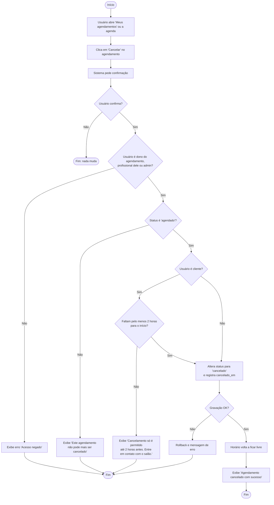

# Diagrama de atividades — Cancelamento de agendamento

```mermaid
flowchart TD
    A([Início]) --> B[Usuário abre 'Meus agendamentos' ou a agenda]
    B --> C[Clica em 'Cancelar' no agendamento]
    C --> D[Sistema pede confirmação]
    D --> E{Usuário confirma?}
    E -- Não --> Z1([Fim: nada muda])
    E -- Sim --> F{Usuário é dono do agendamento,<br/>profissional dele ou admin?}
    F -- Não --> G[Exibe erro 'Acesso negado']
    G --> Z2([Fim])
    F -- Sim --> H{Status é 'agendado'?}
    H -- Não --> I[Exibe 'Este agendamento não pode mais ser cancelado']
    I --> Z2
    H -- Sim --> J{Usuário é cliente?}
    J -- Sim --> K{Faltam pelo menos 2 horas<br/>para o início?}
    K -- Não --> L[Exibe 'Cancelamento só é permitido<br/>até 2 horas antes. Entre em contato com o salão.']
    L --> Z2
    K -- Sim --> M
    J -- Não --> M[Altera status para 'cancelado'<br/>e registra cancelado_em]
    M --> N{Gravação OK?}
    N -- Não --> O[Rollback e mensagem de erro]
    O --> Z2
    N -- Sim --> P[Horário volta a ficar livre]
    P --> Q[Exibe 'Agendamento cancelado com sucesso']
    Q --> Z3([Fim])
```
