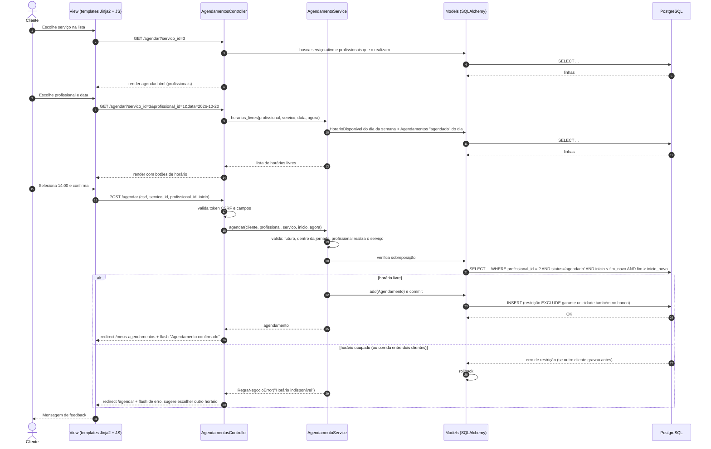

# Diagrama de sequência — "Agendar horário"

```mermaid
sequenceDiagram
    autonumber
    actor C as Cliente
    participant V as View (templates Jinja2 + JS)
    participant AC as AgendamentosController
    participant S as AgendamentoService
    participant M as Models (SQLAlchemy)
    participant DB as PostgreSQL

    C->>V: Escolhe serviço na lista
    V->>AC: GET /agendar?servico_id=3
    AC->>M: busca serviço ativo e profissionais que o realizam
    M->>DB: SELECT ...
    DB-->>M: linhas
    AC-->>V: render agendar.html (profissionais)
    C->>V: Escolhe profissional e data
    V->>AC: GET /agendar?servico_id=3&profissional_id=1&data=2026-10-20
    AC->>S: horarios_livres(profissional, servico, data, agora)
    S->>M: HorarioDisponivel do dia da semana + Agendamentos "agendado" do dia
    M->>DB: SELECT ...
    DB-->>M: linhas
    S-->>AC: lista de horários livres
    AC-->>V: render com botões de horário
    C->>V: Seleciona 14:00 e confirma
    V->>AC: POST /agendar (csrf, servico_id, profissional_id, inicio)
    AC->>AC: valida token CSRF e campos
    AC->>S: agendar(cliente, profissional, servico, inicio, agora)
    S->>S: valida: futuro, dentro da jornada, profissional realiza o serviço
    S->>M: verifica sobreposição
    M->>DB: SELECT ... WHERE profissional_id = ? AND status='agendado' AND inicio < fim_novo AND fim > inicio_novo
    alt horário livre
        S->>M: add(Agendamento) e commit
        M->>DB: INSERT (restrição EXCLUDE garante unicidade também no banco)
        DB-->>M: OK
        S-->>AC: agendamento
        AC-->>V: redirect /meus-agendamentos + flash "Agendamento confirmado"
    else horário ocupado (ou corrida entre dois clientes)
        DB-->>M: erro de restrição (se outro cliente gravou antes)
        M->>M: rollback
        S-->>AC: RegraNegocioError("Horário indisponível")
        AC-->>V: redirect /agendar + flash de erro, sugere escolher outro horário
    end
    V-->>C: Mensagem de feedback
```
